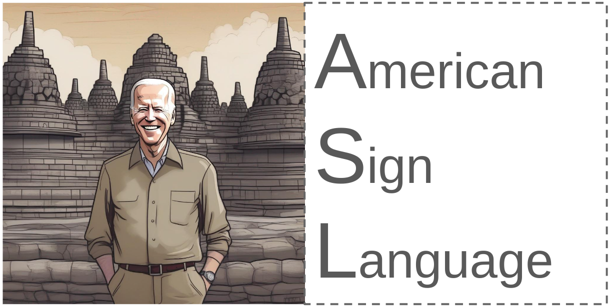

# AmericanSignLanguage



## Introduction
It is a model that used to predict American Sign Language that contains 26 alphabets. The model is trained using a single GPU. 

## How to
This project was built upon python 3.12.2. 
1. You could create the virtual environment by using anaconda command 
```bash
conda create -n rps python=3.12
```
2. Install the requirements 
```bash
pip install -r requirements.txt
```
3. Download the given pretrained model below and put those under `pretrained` folder
4. execute the inference using your webcam
```bash
cd AmericanSignLanguage
python -m asl_detection.infer_webcam
```

## Inference Snippet


## Results
The methods used are YOLOV8 with the following results:

| model | size (pixels) | mAP50 val | mAP50-95 val | FLOPs (B) | Link |
| ----- | ------------- | --------- | ------------ | --------- | ---- |
|YOLOv8n| 640| 0.953 | 0.794 | 8.7 | [download]()
|YOLOv8x| 640| 0.96 | 0.819 | 257.8 | [download]()

*Note : I trained with 2 backbone options that you could choose, the smallest one (YOLOv8n) or the biggest one (YOLOv8X).*

## Contact
If any feature requests please write on this [github issues](https://github.com/hamhanry/AmericanSignLanguage/issues)

## More
Hopefully this pretrained model benefits for those who need it. If you are one that benefits this project, please give me a high five by assigning a *STAR*.